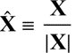
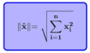

# Guía 03 - Pattern matching, guards y List comprehension

1. Elaborar una función que reciba como parámetro la siguiente lista de notas: [11, 19, 06, 17, 14, 20, 18] y devuelva una lista indicando si es Aprobado o Desaprobado. Utilizar las siguientes condiciones:

- Desaprobado: < 11
- Aprobado: >= 11

2. Elaborar una función que calcule la suma de los números pares de la siguiente lista [3, 12, 8, 9, 10, 15]. Utilice recursividad y list comprehension.

3. Elaborar una función que calcule el promedio ponderado de las notas (valores del 0 al 20) de un alumno, luego devuelva una lista con los aprobados (tomar como referencia las condiciones del ejercicio 1). Utilizar pattern-matching y guards.

4. Elaborar una función que calcule la suma de los elemento pares de una lista. Utilice tail recursion y guards. Puede utilizar list comprehension.

5. Elaborar una función que permita calcular el factorial de un número. Este número debe de ingresarse como argumento de entrada.

6. Elaborar una función que reciba un número N y devuelva una lista con los N primeros números de la sucesión fibonacci.

7. Elaborar una función que reciba un número N y devuelva la suma de los N primeros números de la sucesión fibonacci.

8. Elaborar una función que reciba un número N y devuelva una lista con los N primeros números primos.

9. Elaborar una función que reciba un número N y devuelva la suma de los N primeros números primos.

10. Se tiene una lista que contiene mediciones del peso de una persona (2 mediciones) además del nombre de la persona.
Un ejemplo sería como el siguiente:

``` haskell
[("Pedro", 78.7, 80.4), ("Luis", 79.0, 80.7), ...]
```

Implementar una función llamada pregunta1 que calcule la raiz cuadrada del promedio del error elevado al cuadrado de todas las mediciones realizadas.

El error elevado al cuadrado es el cuadrado de la resta de las dos mediciones. Por ejemplo, en el caso de Pedro sería 78.7-80.4 elevado al cuadrado, o sea 2.89. En el caso de Luis su error elevado al cuadrado es 79.0-80.3 elevado al cuadrado, o sea 1.69.

11. Se tiene una lista de tuplas (cada tupla está formada por 3 floats y un booleano) que representan un vector de posiciones coordenados. Las primeras 3 posiciones de las tuplas marcan las posiciones X,Y,Z en un mundo en 3 dimensiones y la cuarta posición nos indica si el vector debe ser procesado o no. Se nos pide implementar una función llamada pregunta2 que reciba una lista de tuplas como se detalló anteriormente, y nos devuelva una nueva lista con los vectores normalizados. Debe tomar en cuenta que no todos los vectores deben procesarse, solo los que tienen el campo booleano como true. Los vectores que tienen el campo booleano como false, no deben de pertenecer a la nueva lista.

La fórmula para realizar la normalización es la siguiente:



Siendo X el vector sin normalizar y |X| la norma del vector.

La fórmula de la norma del vector es la siguiente:



12. Se tiene una lista de tuplas que representan distintos cursos en la Universidad de Lima, así como información de estos. Tal como se muestra el siguiente ejemplo:

```haskell
listaCursos :: [(String, String, String, Int, Float)] = [
   (“Sistemas”, “Ingeniería de Software”, “Lenguajes de Programación”, 40, 12.34),
   (“Sistemas”, “Ingeniería de Software”, “EDA”, 38, 40.34),
   (“Industrial”, “Investigación de Operaciones”, “Simulación de Procesos”, 42, 30.34),
   (“Industrial”, “Operaciones y Cadena de Suministros”, “Gestión de la Demanda”, 40, 12.34),
   (“Civil”, “Construcción”, “Tecnología de Construcción I”, 42, 15.77)
   …]
```

Como se nota en el ejemplo, cada tupla está formada de 5 elementos:

- Nombre de la carrera (String)
- Nombre del área académica (String)
- Nombre del curso (String)
- Número de matriculados en el curso (Int)
- Porcentaje de desaprobados (Float)

**A**

Implementar una función llamada alumnosMatriculados que reciba como argumento de entrada la lista de cursos y el nombre de la carrera, y devuelva la cantidad total de alumnos matriculados (Int) en todos los cursos de determinada carrera.

**B**

Implementar una función llamada cursoConMayorDesaprobados que reciba como argumento de entrada la lista de cursos, el nombre de la carrera y el nombre del área académica y devuelva el curso que tienen mayor porcentaje de desaprobados. Debe tener en cuenta, que si se envía un String vacío en el argumento de entrada área académica, deberá procesar todos los cursos de la carrera, y si se envía un String vacío en el argumento de entrada de la carrera, deberá procesar todos los cursos de la Facultad de Ingeniería (Sistemas, Industrial y Civil).

**C**

Implementar una función llamada carreraDesaprobados que reciba como argumento de entrada la lista de cursos y nos devuelva una lista de tuplas. Cada tupla contendrá información del nombre de la carrera y la cantidad de ponderada de alumnos desaprobados.

Para calcular la cantidad ponderada, se calculará dividiendo la cantidad total de alumnos matriculados en una carrera y dividirla entre la cantidad de alumnos matriculados totales en la Facultad de Ingeniería. Es número deberá de multiplicarlo por el promedio del porcentaje de desaprobados de la carrera.
